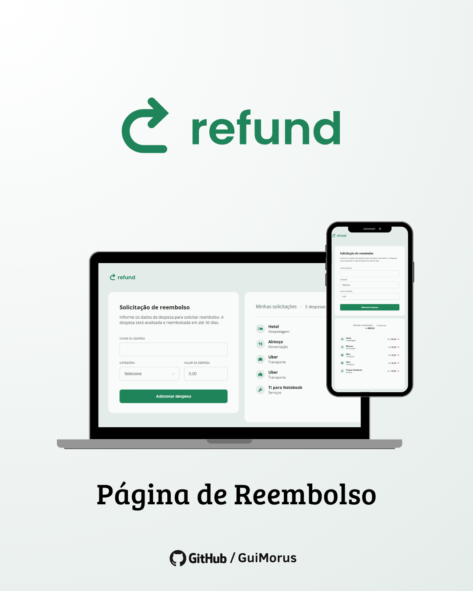

# ↪ Projeto - Refund

Sabe quando você faz algo para a empresa, utiliza seu dinheiro e depois precisa pedir reembolso? Esse projeto é exatamente sobre isso.

No **Refund** você coloca o nome, categoria e valor da despesa para enviar para a empresa, e tem a listagem de todos os custos que teve durante os serviços para onde você trabalha.

## 📷 Media

## 🚀 Tecnologias & Técnicas

- HTML5
- CSS3
- JavaScript
- DOM Manipulation
- Event Listeners
- Form Handling
- Input Validation
- Regular Expressions (Regex)
- Dynamic HTML Rendering
- Data Manipulation
- `toLocaleString()`
- Grid Layout
- Flexbox
- Responsive Design

## 💡 Comentários

Essa é a **primeira vez** que trabalho em um projeto em que eu não fui responsável por criar o HTML e o CSS.

Minha função foi justamente criar o **JavaScript** e dar funcionalidade a um template que já estava pronto. Para isso, precisei analisar o HTML, entender como ele estava estruturado e identificar **IDs** e **Classes** para conectar tudo ao **DOM** e fazer o site ganhar vida.

Foi uma experiência que me fez sentir um pouco como funciona uma produção real, onde uma equipe fica responsável pelo design, outra pelo HTML e eu fico responsável pelo JavaScript e pela lógica da aplicação.

Foi uma experiência completamente diferente para mim, principalmente porque estou acostumado a criar tudo do zero. Dessa vez, precisei primeiro **entender o trabalho de outras pessoas e construir em cima dele**, e isso acabou sendo uma experiência muito interessante.

## 📚 Aprendizados

Neste projeto pratiquei:

- **DOM (Document Object Model):** seleção, criação e manipulação de elementos HTML.
- **Event Listeners:** gerenciamento de eventos e interações do usuário.
- **Formulários e Inputs:** captura, validação e manipulação de dados de entrada.
- **Regex (Regular Expressions):** filtragem e validação de dados utilizando expressões regulares.
- **Manipulação de Strings:** tratamento e transformação de dados textuais.
- **`toLocaleString()`:** formatação de valores numéricos conforme localização e padrão monetário.
- **Renderização dinâmica:** criação e inserção de novos elementos e informações no HTML via JavaScript.
- **Manipulação de dados:** processamento, filtragem e exibição de informações em tempo real.
- **JavaScript moderno (ES6+):** utilização de métodos e recursos nativos da linguagem.

## 🔗 Projeto

- **Deploy:** [Project - Refund](https://guimorus.github.io/project-refund/)
- **Forked Project:** [GitHub - Refund Template, by Rocketseat](https://github.com/rocketseat-education/refund-template)

## 🎖 Créditos

Este projeto ganhou vida pelas mãos de **Guilherme Moreira** como parte dos meus estudos em desenvolvimento Front-end.

### 🎨 Website
O corpo HTML e a estilização CSS foram disponibilizado pela **Rocketseat** através do [GitHub - Refund Template](https://github.com/rocketseat-education/refund-template).

### 📸 Imagens
As imagens utilizadas neste projeto já vieram dentro dos assets do projeto clonado no [GitHub](https://github.com/rocketseat-education/refund-template).

> As imagens foram utilizadas apenas para fins educacionais e de demonstração.